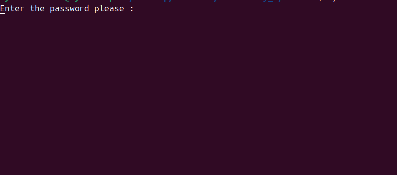
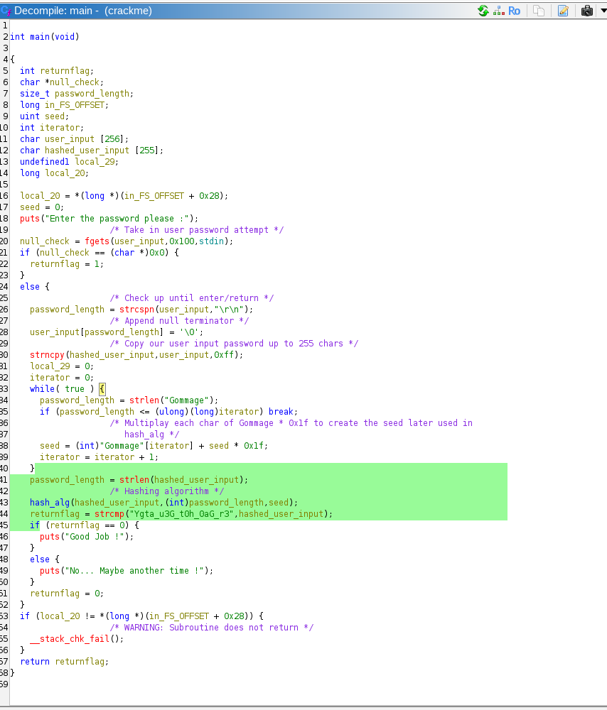
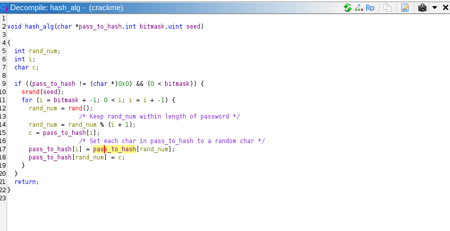

# 45 Exile Shuffle Crackme Writeup
## Tyler Bosford
### Check out crack me @ https://crackmes.one/crackme/686f1b56aadb6eeafb399171

### Overview:
**Difficulty** Rating: 2.3

**Objective**: Enter a password that, when hashed using a Fisher-Yates Shuffle, produces the correct hash result

**Code when ran:**

### Initial Approach:
I approach most crackmes with the same strategy. First, I dissassemble the binary with **objdump -d** and pull all of the strings from the code utilizing **strings [crackme]**. I then check the strings file to see if there are any easy wins available. If not, I move to the assembly and begin to dissect what the code is doing. 

For this particular assignment I was able to identify from the assembly that there were only two functions of interest. The first was the main function which housed the logic for user input. The second was a hashing function, I will call hash_alg, that was called from main. 

### Ghidra
Once I gained as much knowledge as I could from the assembly I moved the code into Ghidra for further analysis. Below is a screenshot of the items I identified within Ghidra and the names I gave them in an attempt to understand the source code:

**How it works**: The main function takes in user input and stores it as a c-style string up to where the user clicks enter (which would leave a \r\n), reference **line 26**. It then copies the user_input into what I am calling hash_input, which is the item that is about to be sent through the hashing algorithm. At line **38** the function creates the seed, that will be later used in the hash_alg function, by taking each ASCII value of the string 'Gommage' adding it to the previous char and multiplying it by 31 (0x1f).

### hash_alg
hash_alg utilizes the **Fisher-Yates Shuffle** which selects a random index between 0 and the length of the password (See lines 11-18 below) and swaps the value at that index with the value at the end of the string: 

### Cracking the Algorithm
Identifying how the code works was not difficult to do. However, reversing the Fisher-Yates shuffle proved a bit challenging initially. 

**How to 'unshuffle' Fisher-Yates**: To unshuffle Fisher-Yates, I followed the following steps:
1. Regenerate the same seed used for the original shuffle
2. Create key-value pairs for the values that were swapped during the original shuffle [swap(len(password)-1, first random index)]
3. Create a new list of these key-value pairs except this time flip the key-value pair such that (value, key) and then reverse the list
4. Perform the swap utilizing the new value-key pair created in step 3 on the hashed version of the password. (See exploit.py)

### Impediments
Although I had researched how to unshuffle the algorithm, I still noticed that I was getting the wrong answer each time. My initial assumption was that I had messed up the unshuffle algorithm or had an off by one error. However, it dawned on me that I may be producing the wrong seed.

My seed construction formula was: `seed += ord(c) * 31` when it actually should have been `seed = ord(c) + seed * 31`. This simple mistake was throwing the entire unshuffle process off! 

# SPOILERS BELOW FOR CRACKME

### Solution
The final cracked password was **GG_Y0u_ar3_th3_g0at** which when ran through the shuffle creates the hashed algorithm compared to on line 44 of the main function. 
